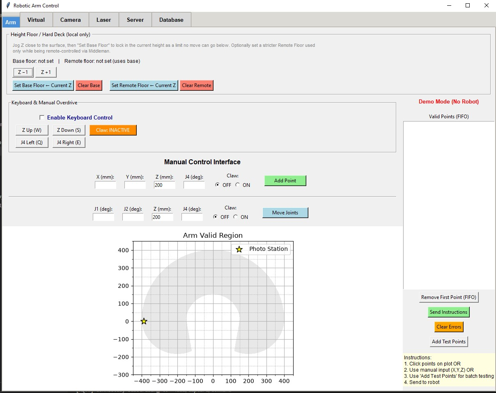
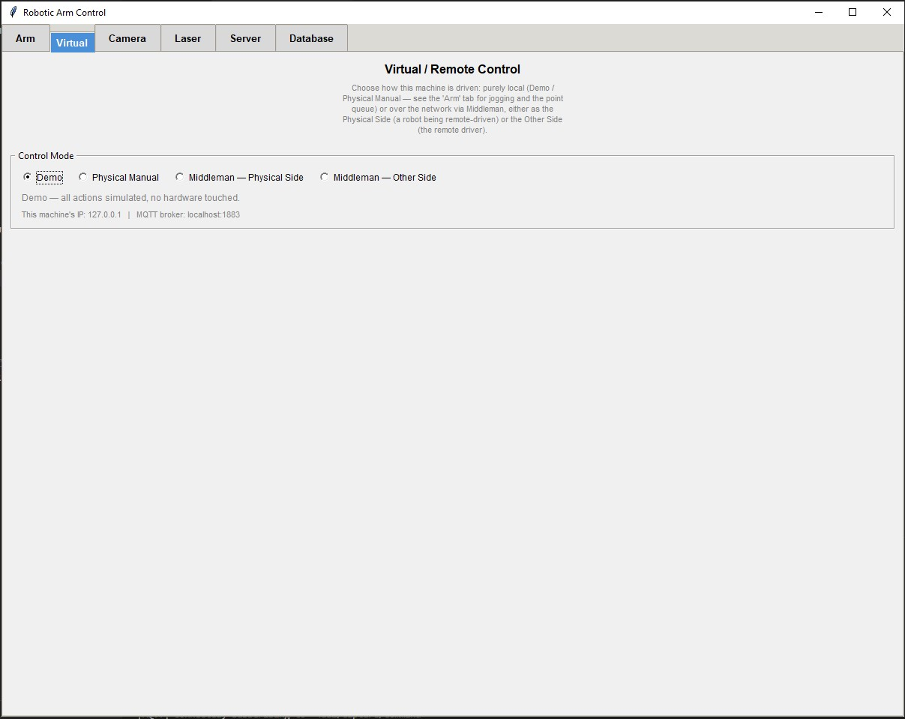
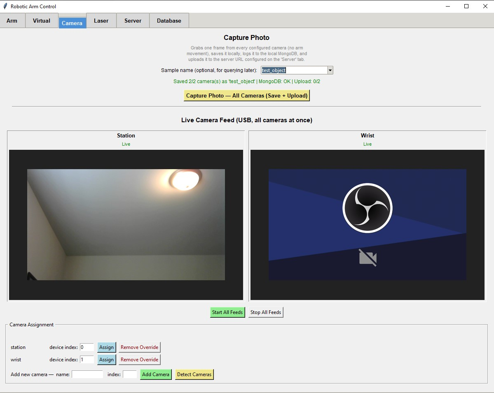
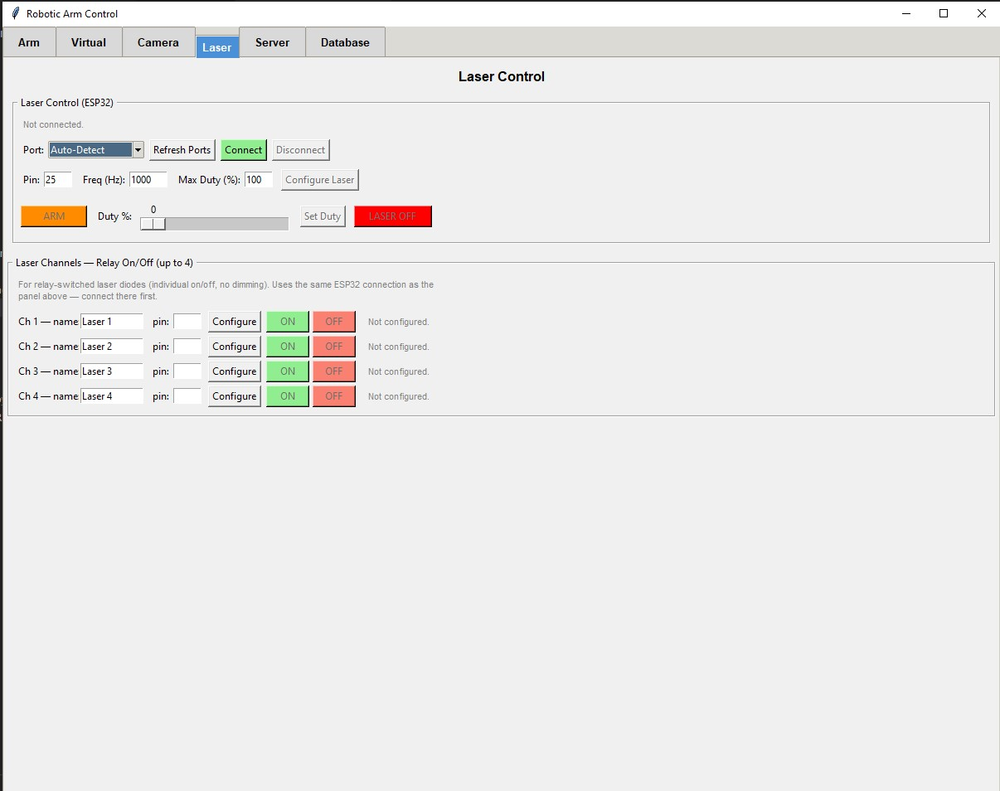
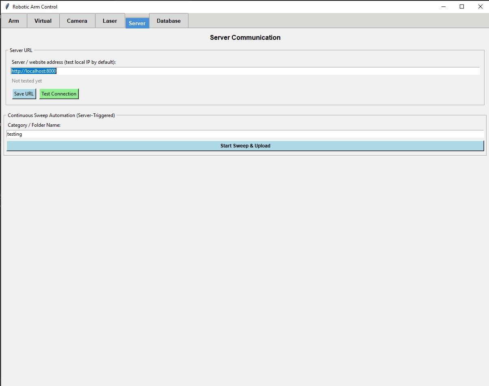
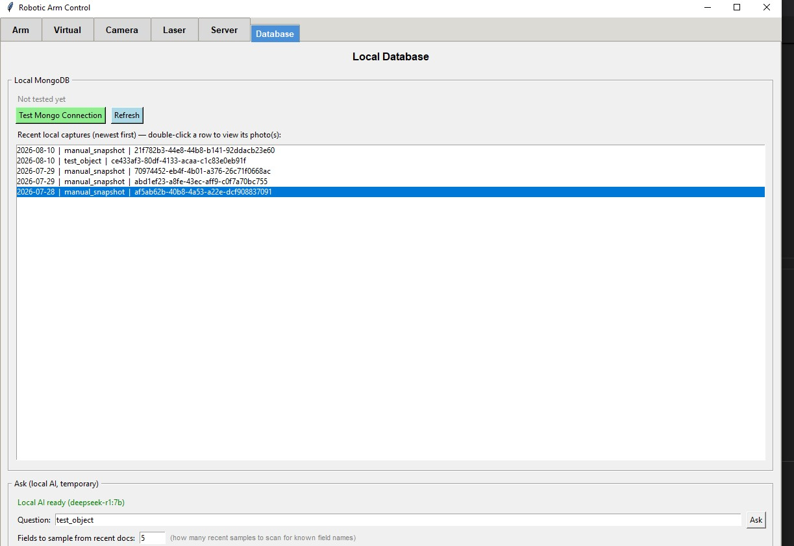
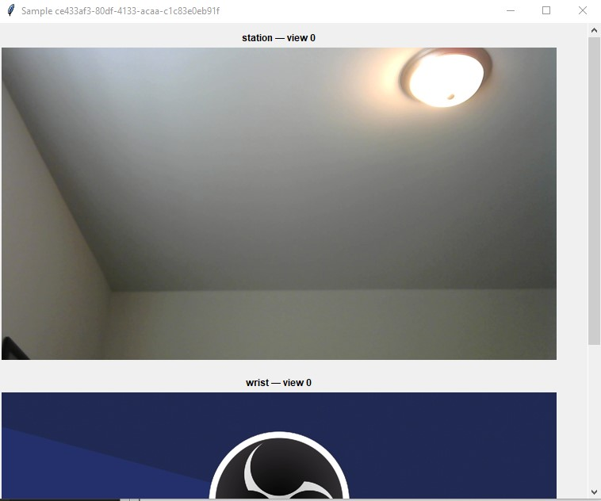

# Robotic Arm Controller

A Python application that controls a robotic arm by inputting **Cartesian coordinates (X, Y, Z)**.

**Future version**: will allow control through **individual joint angles**, enabling movement by controller and later by AI.

## Features
- Move the robotic arm by specifying X, Y, Z coordinates
- Visualize coordinates on an XY plot
- Maintain a FIFO list of coordinates to be executed by the arm

## Setup and Installation
Follow these steps to set up the project and install all required dependencies.

1. **Clone the repository**
```powershell
git clone https://github.com/yourusername/robotic-arm-controller.git
cd robotic-arm-controller
```
2. **Create a virtual environment**
```powershell
python -m venv venv
```
3. **Activate the virtual environment**
```powershell
.\venv\Scripts\Activate.ps1
```
4. **Install Dependencies**
```powershell
pip install -r requirements.txt
```
5. **Run the Application**
```powershell
python main.py
```

## Using the GUI (while `main.py` is running)
When you start the application with `python main.py`, the GUI window will open and let you plot and send coordinate sequences to the robotic arm. Below are general usage instructions and recommended workflows.

- **Plotting points**: Use the plot area to add or visualise points in the XY plane. Depending on the GUI controls you can typically add points by clicking the plot or by entering exact coordinates in the input fields.
- **Adding coordinates to the list**: Enter coordinates using the provided input fields (X, Y, Z) and press the button to append them to the coordinate list. The list follows a FIFO protocol: the oldest coordinate will be executed first when you send the list to the arm.
- **Editing / Removing points**: Use the list controls to remove or reorder entries before sending. If the GUI supports it, select a point and delete or edit the values.
- **Sending to the arm**: There is a control/button to send the queued coordinate list to the robotic arm. Press it to begin execution. Monitor the GUI for status updates or errors.
- **Start / Stop / Pause**: Use the provided start/stop/pause controls to control execution. If your GUI does not have pause, stop will typically abort execution and clear or retain the queue depending on settings.

### Coordinate format
- Coordinates are Cartesian triples: `X, Y, Z` (units depend on your arm configuration, commonly millimeters).
- Example entry: `X: 150, Y: 0, Z: 100`
- Example list (pseudo-format):
```
[(150, 0, 100), (160, 20, 90), (140, -20, 95)]
```

### Typical workflow
1. Start the application: `python main.py` and wait for the GUI window.
2. Use the plot or input fields to add the desired waypoints to the list.
3. Verify the order of waypoints in the FIFO list. Edit or remove any points as needed.
4. Click `Send` (or equivalent) to begin execution on the robotic arm.
5. Monitor the status in the GUI and use `Stop` immediately if anything behaves unexpectedly.

### Safety & troubleshooting
- **Safety first**: Keep a safe distance from the arm during motion. Ensure no objects or people are inside the workspace when commanding moves.
- **Limits**: If a coordinate is outside the robot's reachable workspace, the arm may error or behave unpredictably. Validate coordinates before sending.
- **Connection errors**: If the GUI cannot communicate with the arm, check cables, power, and the device connection settings (serial port, IP, etc.). Restart the app after fixing connection issues.
- **Logs / Errors**: Check the terminal running `main.py` for log output and error messages — they usually provide clues for what went wrong.

## Example
1. Add three points: `(150, 0, 100)`, `(160, 20, 90)`, `(140, -20, 95)`.
2. Confirm order in the FIFO list.
3. Click `Send` to move the arm through the points in order.

## GUI Tabs Overview
`main.py`'s GUI is organized into six tabs. Screenshots below reflect the
current layout.

### Arm
Direct physical control only: the Height Floor / Hard Deck safety limit,
keyboard/manual jog overdrive, the manual XYZ and joint-move point
controls, and the FIFO point queue. No Control Mode or Middleman UI lives
here — see the "Virtual" tab for that.



### Virtual
Control Mode selection (Demo / Physical Manual / Middleman — Physical
Side / Middleman — Other Side) and every Middleman-specific panel: the
remote controller queue, the Physical Side discovery/connect dropdown,
remote capture, and remote laser toggles.



### Camera
The "Capture Photo" action sits at the top of this tab — it's the flow
that actually stores something: it saves each configured camera's frame
locally, logs the sample to the local MongoDB, and uploads it to the
server URL configured on the "Server" tab. An optional "Sample name"
field lets you tag a capture (e.g. `test_object`) so it's easy to find
again later on the "Database" tab. Below that is the live multi-camera
feed and camera device-index assignment.



### Laser
The ESP32 laser controller: serial connect/disconnect, PWM
configure/arm/fire, and the per-channel relay on/off toggles (up to 4
relay-switched laser diodes). The Python client that talks to it lives
in `laser_control/`; the board-side firmware it talks to is the
PlatformIO project in [`ESP32_Laser_Control/`](ESP32_Laser_Control)
(`src/main.cpp`) — flash that onto the ESP32 with `pio run -t upload`
from inside that folder.



### Server
The server URL used for uploads (test-local by default), a connection
test, and the server-triggered continuous-sweep automation.



### Database
Browse recent local captures (double-click a row to view its photo(s) in
a popup viewer, shown below) and, if Ollama is running locally, ask
plain-English questions against the local MongoDB via the "Ask (local
AI, temporary)" panel.



**Sample photo viewer** (opens when you double-click a row on the
Database tab):



## Images


## Mac compatibility
This project works on macOS with these small adjustments. Use `python3` on macOS and create/activate the virtual environment as shown below.

1. Create venv:
```bash
python3 -m venv venv
```
2. Activate venv (macOS / Bash / Zsh):
```bash
source venv/bin/activate
```
3. Install dependencies:
```bash
pip install -r requirements.txt
```
4. Run the application:
```bash
python3 main.py
```

Notes for macOS users:
- If you use a conda environment, you can skip the `venv` steps and use `conda activate` instead.
- If any GUI libraries require a specific backend on macOS (e.g., for matplotlib), the terminal logs will indicate missing backends; install the required packages (for example, `pip install pyobjc-framework-Quartz` or follow the library-specific instructions).

## Network connection: Ethernet 2
To interact with the robot the PC must be connected to the robot controller over Ethernet. On Windows the GUI expects the network link on the machine's Ethernet adapter named or routed through `Ethernet 2` (this is how our environment is set up). On macOS and other platforms the same idea applies: connect the PC's Ethernet port directly to the robot controller (or to the switch on the same subnet) and ensure your machine's interface is on the same subnet as the robot.

Steps to configure the connection (generic):
1. Physically connect an Ethernet cable between your computer and the robot controller or switch.
2. Identify the local interface that corresponds to that port (Windows: `Ethernet 2`; macOS: likely `en0`, `en1`, or a Thunderbolt Ethernet adapter). Use System Preferences/Settings → Network or `ifconfig`/`ipconfig` to identify the interface.
3. Assign a static IP on the same subnet as the robot controller. Example (macOS):
```bash
# replace en0 with your interface name and choose an IP in the robot's subnet
sudo ifconfig en0 inet 192.168.1.100 netmask 255.255.255.0
```
On Windows use the GUI network settings to set a manual IPv4 address that matches the robot's subnet and use `Ethernet 2` as the active interface.
4. Connect from the GUI using the robot's IP address (enter it in the GUI's connection field or ensure the GUI is configured to use the same interface). If you don't know the robot's IP, check the robot controller documentation, or scan the local subnet with a network tool (for example `nmap`) to locate the device.

Troubleshooting tips:
- If the GUI shows "Demo Mode (No Robot)", check that the Ethernet interface is up and that the selected interface is the one connected to the robot.
- Ensure any OS firewall is disabled or configured to allow the GUI application to communicate on the local network.
- If you cannot reach the robot, try pinging the robot IP from a terminal to confirm connectivity.

If you'd like, I can extract exact connection fields and button names from `Interface.py` and update the README to show the exact GUI steps (I won't modify `Interface.py` itself unless you ask).

## Integration with 4DAI Server

This arm no longer owns any camera hardware directly. Photo capture has
been handed off entirely to the **4DAI server** — when the arm wants a
photo taken (during a pickup/photograph sequence or a sweep), it sends a
capture trigger over HTTP, and 4DAI's Streamlit UI takes the photo using
the browser's webcam and saves it. The arm never touches `cv2`, a
webcam, or a live camera preview anymore.

The 4DAI server code lives in this repo under [`server-4dai/`](server-4dai/).

> **Note on this merged codebase:** the local-camera pipeline (`CAMERAS` in
> `vision/config.py`, the Live Camera Feed panel, `pickup_photograph_and_identify`,
> `run_automatic_capture_sequence`) is still present and still the default —
> it was kept as the base. The 4DAI-server-triggered versions of the
> capture pipeline live alongside it under a `_server_dependent` suffix
> (e.g. `pickup_photograph_and_identify_server_dependent`,
> `run_pickup_photograph_and_identify_server_dependent`,
> `_handle_capture_command_server_dependent`), plus the standalone
> `run_continuous_sweep` feature and its "Continuous Sweep Automation" UI
> panel, which have no local-camera equivalent.

### How the two sides talk to each other
- The arm POSTs to `{FOURDAI_API_URL}/collection/trigger-webcam-capture`
  whenever it wants a photo taken.
- 4DAI's UI polls `/collection/check-trigger` and, when a trigger comes
  in, switches to the Collection page (requesting webcam permission if
  it hasn't been granted yet) and takes the photo.
- `FOURDAI_API_URL` is set in `vision/config.py` on the arm side —
  `http://localhost:8000` for local testing (`TEST_MODE = True`), or the
  real server address if the arm and server are on separate machines.

### Starting the local 4DAI server
Run these from `server-4dai/`, in order:

1. **Start MongoDB**
   ```bash
   mongosh   # confirms it connects; Ctrl+D to exit
   ```

2. **Start the FastAPI backend**
   ```bash
   cd Server
   uvicorn main:app --host 0.0.0.0 --port 8000
   ```
   Leave this running — this is what both the arm and the Streamlit UI
   talk to.

3. **Start the Streamlit UI** (in a separate terminal)
   ```bash
   cd UI
   streamlit run home.py
   ```
   Opens at `http://localhost:8501`. Check `UI/key.py` points `URL` at
   the running server (`http://localhost:8000` for local testing).

4. **Grant camera permission once, up front.** Open any category's
   Collection page in the browser and allow webcam access before
   relying on automatic capture from the arm — the camera widget has to
   be visible on-screen for the browser to prompt for permission at all.

With both the arm (`python main.py`) and the 4DAI server/UI running
locally, a pickup-and-photograph sequence on the arm should trigger a
photo automatically in the browser and save it under
`server-4dai/images/<category>/auto_capture/`.

See [`server-4dai/README.md`](server-4dai/README.md) for the full server
setup and troubleshooting details.

## Video Walkthrough

[](https://youtu.be/GgRfbci3YlA)
