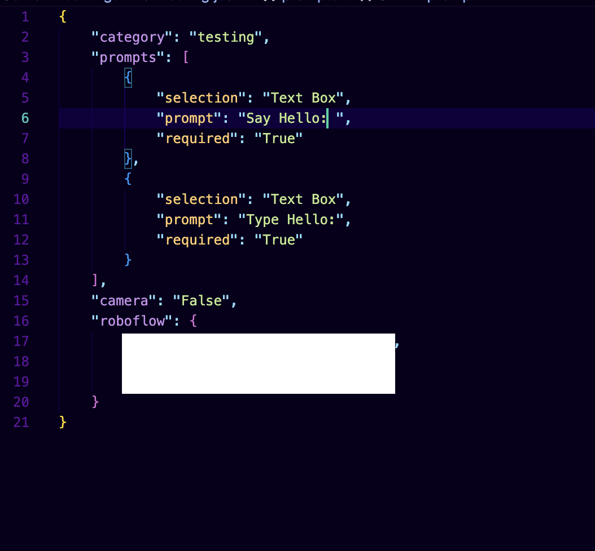

# Dynamic Data Collection Platform

## Overview

The Dynamic Data Collection Platform is a web-based application designed to create, manage, and collect custom datasets through dynamically generated forms and image capture. The system consists of a Streamlit frontend for user interaction and a FastAPI backend for data storage and retrieval.

Unlike traditional collection systems that are limited to specific data types, this platform allows users to create their own collection categories, define custom prompts, capture multiple images per sample, and optionally synchronize collected data with Roboflow.

The application supports:

* Custom category creation
* Dynamic form generation
* Multiple image capture per sample
* MongoDB data storage
* Image management and downloads
* Date-based filtering
* Roboflow integration
* Category editing and management
---

# Technologies Used

## Frontend

* Streamlit

## Backend

* FastAPI
* Uvicorn

## Database

* MongoDB

## Networking / Deployment

* ngrok (optional remote access)

## Programming Language

* Python 3.10+

---

# Installation References

## MongoDB

Installed using the official MongoDB documentation:

https://www.mongodb.com/docs/manual/installation/

## ngrok

Installed and configured using:

https://ngrok.com/docs/getting-started/

---

# Project Structure

```text
project/
│
├── Server/
│   ├── main.py
│   ├── images/
│   │   └── category_name/
│   │       └── sample_id/
│   │
│   └── settings/
│       └── category.json
│
├── UI/
│   ├── home.py
│   ├── key.py
│   └── pages/
│       ├── settings.py
│       ├── collection.py
│       └── view_data.py
│
├── requirements.txt
└── README.md
```

---

# Features

## Category Management

The Settings page allows users to create and manage custom collection categories.

Users can:

* Create unlimited categories
* Define custom prompts for each category
* Edit existing categories
* Delete prompt fields
* Add new prompt fields to existing categories
* Configure camera settings
* Configure Roboflow integration
* Save category configurations

Category configurations are stored as JSON files on the server.

```text
settings/
├── Vegetables.json
├── Soil_Moisture.json
├── Plant_Health.json
└── ...
```



---

## Dynamic Form Generation

Collection forms are generated automatically from each category's configuration.

Supported prompt types include:

* Text Box
* Text Area (multi-line)
* Number Input
* Dropdown List
* Radio Button
* Slider

Validation is performed to ensure proper prompt configuration before categories can be saved.

---

## Data Collection

Users can:

* Select a collection category
* Complete category-specific forms
* Capture images directly from their browser
* Attach multiple images to a single sample
* Submit metadata and images together

Each submission automatically receives a unique Sample ID.

---

## Image Management

Images are organized by category and sample ID.

```text
images/
├── Category_A/
│   └── sample_id/
│       ├── image_1.jpg
│       ├── image_2.jpg
│       └── ...
│
└── Category_B/
    └── sample_id/
```

Each image receives a unique Image ID and is linked to its associated sample.

---

## Roboflow Integration

The platform includes optional Roboflow integration.

When enabled for a category, users can configure:

* Roboflow API Key
* Workspace Name
* Project ID

The application validates credentials before saving.

During sample submission:

* Images are automatically uploaded to Roboflow
* Metadata is attached to each uploaded image
* Metadata includes Sample IDs and collected form responses

This allows datasets collected through the platform to be synchronized directly with Roboflow projects.

---

## Data Viewing

The View Collections page allows users to browse and review collected data.

Features include:

* Category selection
* Date range filtering
* Viewing sample information
* Viewing collected form responses
* Viewing all images associated with a sample
* Downloading individual images

Collected records are displayed in expandable sections for easier navigation.

---

# Database Structure

MongoDB stores sample information and image metadata.

Database:

```text
Collections
```

Collections:

```text
Collections
├── images
├── category_1
├── category_2
├── category_3
└── ...
```

Each category created through the Settings page becomes its own MongoDB collection.

---

# Installation

## Clone Repository

```bash
git clone <repository-url>
cd project
```

## Create Virtual Environment

### Mac/Linux

```bash
python3 -m venv app
source app/bin/activate
```

### Windows

```bash
python -m venv app
app\Scripts\activate
```

## Install Dependencies

```bash
pip install -r requirements.txt
```

---

# MongoDB Setup

Install MongoDB and start the service.

Verify installation:

```bash
mongosh
```

MongoDB runs locally by default at:

```text
mongodb://localhost:27017
```

---

# Running the Backend Server

Navigate to the Server directory:

```bash
cd Server
```

Start FastAPI:

```bash
uvicorn main:app --host 0.0.0.0 --port 8000
```

Backend URL:

```text
http://127.0.0.1:8000
```

---

# Optional: Exposing the Backend with ngrok

If the frontend and backend run on different machines, expose the backend using ngrok:

```bash
ngrok http 8000
```

Example:

```text
Forwarding https://xxxx.ngrok-free.app -> http://localhost:8000
```

Update the frontend URL in:

```python
# UI/key.py

URL = "https://xxxx.ngrok-free.app"
```

---

# Running the Streamlit Frontend

Navigate to the UI directory:

```bash
cd UI
```

Run Streamlit:

```bash
streamlit run home.py
```

Frontend URL:

```text
http://localhost:8501
```

---

# API Endpoints

## Category Configuration

### Get Available Categories

```http
GET /home
```

### Get Category Configuration

```http
GET /settings/{category}
```

### Create or Update Category Configuration

```http
POST /settings
```

---

## Sample Management

### Create Sample Submission

```http
POST /collection/submission
```

### Upload Sample Image

```http
POST /collection/images/upload
```

### Retrieve Samples for a Category

```http
GET /collection/samples/{category}
```

---

## Image Management

### Retrieve Images for a Sample

```http
GET /collection/images/{sample_id}
```

### Retrieve a Specific Image

```http
GET /collection/image/{image_id}
```

---


# Author

Yarely Torres
